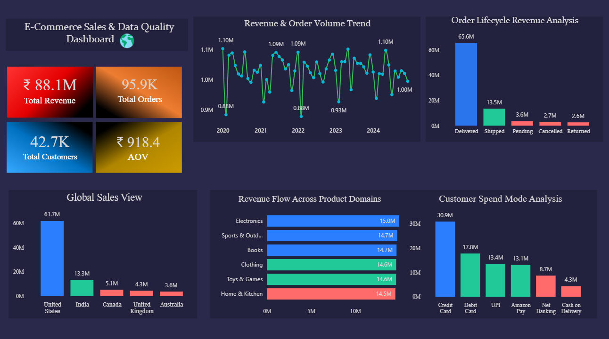

# 📊 E-Commerce Sales Analytics

## 📌 Project Overview
Analyzed 100,000+ e-commerce transactions to uncover revenue trends, customer behavior, and product performance insights. This project demonstrates end-to-end data analysis using SQL and Power BI.

---

## 🎯 Business Objectives
- Identify revenue trends over time  
- Discover top-performing products  
- Segment customers based on purchasing behavior  
- Analyze payment method preferences  

---

## 🛠️ Tech Stack
- SQL (MySQL)
- Power BI
- Excel

---

## 📊 Key Insights
- High-revenue generated from specific product categories  
- Peak sales observed during seasonal periods  
- Majority transactions completed via digital payment methods  
- Identified high-value customer segments  

---

## 📸 Dashboard Preview

---

## 🧾 SQL Analysis

- `data_overview.sql` → Data exploration and cleaning  
- `kpi_queries.sql` → KPI generation and business insights  

📂 All queries available in the `/sql` folder.

---

## 📎 Project Links
- 🔗 [View Power BI Dashboard](https://app.powerbi.com/view?r=eyJrIjoiNDVhOTM5YTEtZjI2MC00ZTRmLThkM2UtOWRhZWQ1ZmY1ZGRhIiwidCI6IjgzY2U2OTI0LTViZjctNDE3ZS05YWZjLWMxOWQ4YjZkYzAwOCJ9)

---

## 🚀 Key Skills Demonstrated
- Data Cleaning & Transformation  
- Exploratory Data Analysis (EDA)  
- KPI Development  
- Data Visualization  
